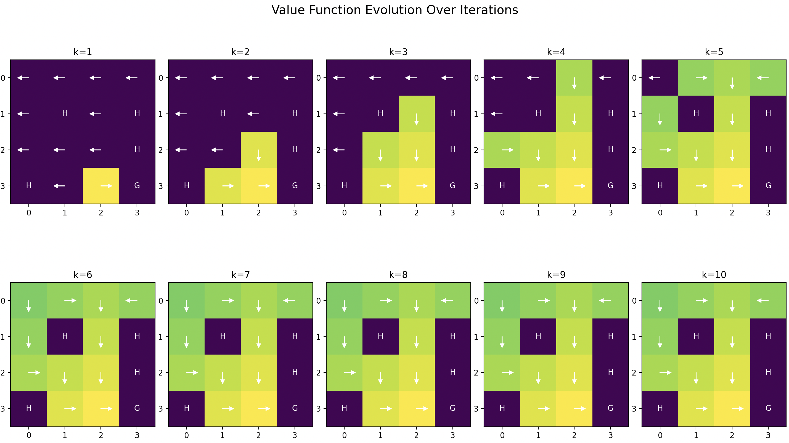

To put learned RL concepts (such as Markov decision process, state/action spaces, Q-function for state-action values, and V-function for state values) into practice, I implemented the value iteration algorithm for the Frozen Lake environment. Since gymnasium's FrozenLake environment required agentic behaviour, for the purposes of value iteration I implemented the environment myself. 

The value iteration algorithm converges to identify the optimal path that maximizes expected future rewards while avoiding holes.

Resources:
https://d2l.ai/chapter_reinforcement-learning/value-iter.html# 
https://gymnasium.farama.org/environments/toy_text/frozen_lake/ 